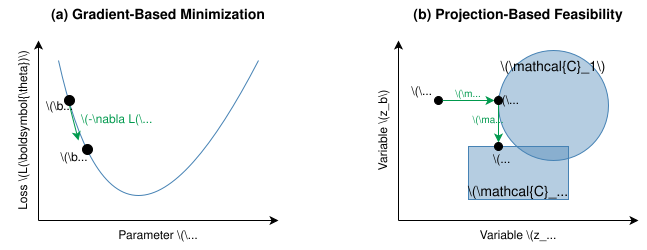
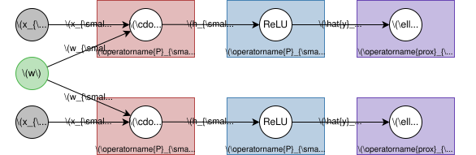

# PJAX: A projection-based framework for gradient-free and parallel learning

[](https://arxiv.org/abs/2506.05878)


PJAX (Projection JAX) is a numerical computation framework designed to explore a novel paradigm for training neural networks. Instead of relying on gradient-based loss minimization, PJAX reformulates training as a large-scale feasibility problem, solved using iterative projection methods. This approach offers inherent support for non-differentiable operations and local updates, enabling massive parallelism across the network. 

PJAX is built on top of [JAX](https://github.com/google/jax), inheriting its capabilities for JIT compilation, execution on hardware accelerators (CPU/GPU/TPU), and a NumPy-like API.

## The projection-based training paradigm



*Figure 1: Neural network training paradigm shift. (a) Gradient-based methods iteratively minimize a loss function $`L(\mathbf{\theta})`$ using local gradients. (b) Our projection-based feasibility approach finds a point $`\mathbf{z}`$ in the intersection of constraint sets (e.g., $`C_1, _2`$) via iterative projections onto these sets.*

Traditional neural network training minimizes a global loss function using gradients computed via backpropagation. Our projection-based approach takes a different route:

1.  **Feasibility Formulation:** We view neural network training as finding a set of network parameters and internal states (activations, intermediate values) that simultaneously satisfy a collection of local constraints. These constraints are derived from:
    *   The network's architecture: Each elementary operation (e.g., dot product, ReLU activation) imposes a constraint that its inputs and outputs must conform to its definition.
    *   The data: Input-output examples from the training set impose constraints on the network's overall behavior (e.g., correct classification).

2.  **Computation Graph:** The network and the learning task are represented as a computation graph where nodes are elementary operations or data points, and edges represent data flow. Variables are associated with the edges of this graph.

    
    
    *Figure 2: Conceptual computation graph for $`\ell(\mathrm{ReLU}(w \cdot x_i), y_i)`$ on two samples, showing projection operators for hidden function and loss nodes.*

3.  **Projection Operators:** For each elementary operation (primitive function) $`f`$, we define an orthogonal projection operator onto the graph of that function. This operator finds the closest point on the function's graph to a given query point:
```math
\mathrm{P}_{\mathrm{Graph}(f)}(x_0, y_0) = \mathrm{arg\,min}_x \, \|x - x_0\|^2 + \|f(x) - y_0\|^2.
```
5.  Similarly, output constraints (derived from the loss function) also have associated projection or proximal operators.

6.  **Iterative Algorithms:** Training becomes the problem of finding a point in the intersection of all these local constraint sets. Iterative projection algorithms, such as Alternating Projections (AP), Cyclic Projections (CP), or Douglas-Rachford (DR), are employed to find such a feasible point. These algorithms repeatedly project the current state onto the constraint sets, converging towards a solution.

**Advantages:**
*   **Gradient-Free:** Accommodates non-differentiable components naturally.
*   **Local Updates:** Modifications are local to nodes and their immediate neighbors in the graph.
*   **Parallelizable:** The local nature of updates allows for massive parallelism, updating each neuron's parameters concurrently without forward/backward passes.

## The PJAX framework

PJAX is designed to make this projection-based paradigm accessible and extensible. Its design philosophy is analogous to automatic differentiation libraries (like JAX, PyTorch, TensorFlow), but instead of computing gradients, PJAX orchestrates the solution of feasibility problems using projection operators.

### Core components

*   **Primitive Functions:** Implementations of elementary operations (e.g., `pjax.dot`, `pjax.sum_relu`, `pjax.max`, `pjax.quantize`) and their corresponding projection operators.
*   **Loss Functions / Output Constraints:** Operators applied at the output of the network to enforce learning objectives (e.g., `pjax.cross_entropy` proximal operator, `pjax.margin_loss` projection).
*   **Shape Transformations:** Operations like `pjax.reshape`, `pjax.transpose`, `pjax.concatenate` that manipulate tensor shapes. These are handled by transforming data between primitive function projections without imposing their own feasibility constraints.

### User API

PJAX provides a Python API that mirrors NumPy/JAX for ease of use:

*   **`pjax.Computation`:** The fundamental class for objects managed by PJAX. It can hold data or represent the symbolic output of a PJAX operation.
*   **`pjax.Array` & `pjax.Parameter`:** Subclasses of `Computation` for constant input data and learnable parameters, respectively. They wrap JAX arrays.
*   **API Functions:** PJAX offers a suite of functions (e.g., `pjax.dot`, `pjax.relu`) that operate on `Computation` objects, automatically building the computation graph.
*   **`pjax.vmap`:** A utility for automatic vectorization of functions composed of PJAX operations, similar to `jax.vmap`.

### Optimizer module (`pjax.optim`)

This module contains algorithms to solve the feasibility problem defined by the computation graph:
*   Currently implemented: `AlternatingProjections` (AP), `DouglasRachford` (DR), `CyclicProjections` (CP), `DifferenceMap` (DM).
*   The `optimizer.update(loss_fn, params)` method takes a function defining the computation (which implicitly defines constraints) and current parameters, performs projection steps, and returns updated parameters.

### High-level neural network API (`pjax.nn`)

Inspired by [Flax](https://github.com/google/flax), `pjax.nn` simplifies the definition of neural network models:
*   **`pjax.nn.Module`:** A base class for creating reusable model components (layers, blocks).
*   **Pre-built Layers:** Includes common layers like `Linear`, `ReLU`, `Conv2D`, `MultiHeadAttention`, `Embedding`, etc.
*   Automates parameter initialization and naming.

### Project structure

The main library code is organized as follows:

```
./
└── pjax/
    ├── core/
    │   ├── computation.py    # computation graph construction and Computation classes
    │   ├── api.py            # user-facing API functions (wraps no_ops and ops)
    │   ├── no_ops.py         # shape transformations and their inverse operations
    │   ├── ops.py            # primitive functions and their projection operators
    │   └── frozen_dict.py    # immutable dictionary utilities
    ├── nn/
    │   ├── modules.py        # neural network modules and layers
    ├── optim.py              # projection-based optimizers 
    ├── config.py             # configuration settings
```

## Installation

### Prerequisites
*   Python 3.10 or higher.
*   JAX installed (see JAX documentation for installing with CPU/GPU/TPU support: [https://github.com/google/jax#installation](https://github.com/google/jax#installation)).

### From source
```bash
git clone https://github.com/AndreasBergmeister/pjax.git
cd pjax
pip install .
```

### For development and running all examples
To install dependencies required for development (e.g., linters, formatters) and for running all examples (which may include comparisons with Flax/Optax models or use additional utilities):
```bash
pip install .[dev]
```

## Quick start: MLP example

Here's how to define a simple Multi-Layer Perceptron (MLP) and set up a basic training step using PJAX:

```python
import jax
import pjax
from pjax import nn, optim

# 1. Define the model
class MLP(nn.Module):
    def __init__(self, in_features, hidden_features, num_classes):
        super().__init__()
        self.dense1 = nn.Linear(in_features, hidden_features)
        self.relu = nn.ReLU(hidden_features)
        self.dense2 = nn.Linear(hidden_features, num_classes)

    def __call__(self, x):
        x = self.dense1(x)
        x = self.relu(x)
        x = self.dense2(x)
        return x

# 2. Initialize model and optimizer
key = jax.random.key(0)
model = MLP(in_features=784, hidden_features=256, num_classes=10)
params = model.init(key)

optimizer = optim.DouglasRachford(steps_per_update=50)

# 3. Define a training step
@jax.jit
def train_step(params, x, y):
    def apply_fn(params):
        logits = model.apply(params, x)
        y_one_hot = jax.nn.one_hot(y, num_classes=10)
        return pjax.cross_entropy(logits, y_one_hot)

    updated_params, loss = optimizer.update(apply_fn, params)
    return updated_params

# 4. Training loop
for step in range(1000):
    x, y = get_batch(step)
    params = train_step(params, x, y)
```

For more detailed examples, including various architectures (MLPs, CNNs, RNNs) and comparisons with gradient-based methods, see [`examples/comparison.py`](comparison.py). Dataloaders for `MNIST`, `CIFAR-10`, `HIGGS`, and `Shakespeare` datasets are provided in provided in [`examples/data.py`](data.py).

## Running experiments

The `examples/comparison.py` script allows you to benchmark PJAX against standard optimizers on various datasets and model architectures.

Example command:
```bash
python examples/comparison.py \
    --dataset MNIST \
    --model_type mlp \
    --optimizer dr \
    --hidden_features 128 128 \
    --skip \
    --batch_size 256 \
    --steps_per_update 50 \
    --num_runs 5 \
    --patience 5 \
    --eval_every 1000 \
    --log_file results/mnist_mlp_dr.csv
```
Use `python examples/comparison.py --help` for a full list of options.

## Citation

If you use PJAX in your research, please cite our [paper](https://arxiv.org/abs/2506.05878) as:

```bibtex
@article{bergmeister2025pjax,
    title={A projection-based framework for gradient-free and parallel learning},
    author={Andreas Bergmeister and Manish Krishan Lal and Stefanie Jegelka and Suvrit Sra},
    year={2025},
    journal={arXiv preprint arXiv:2506.05878},
}
```

